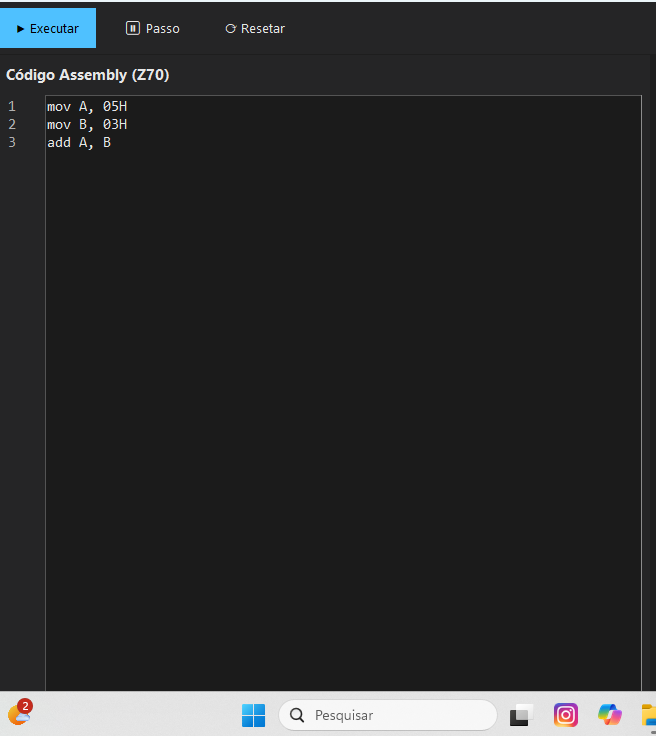
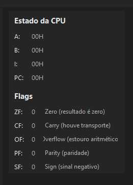
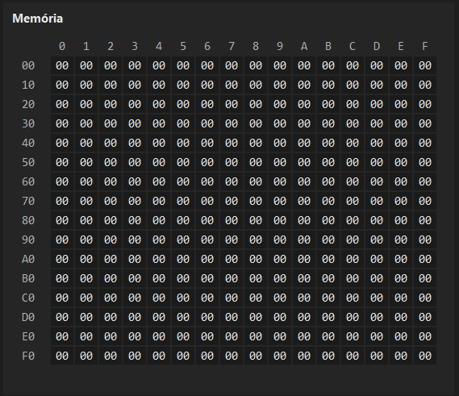
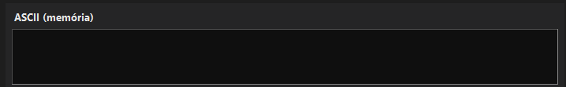
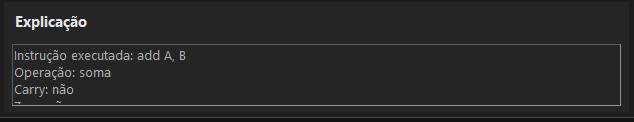
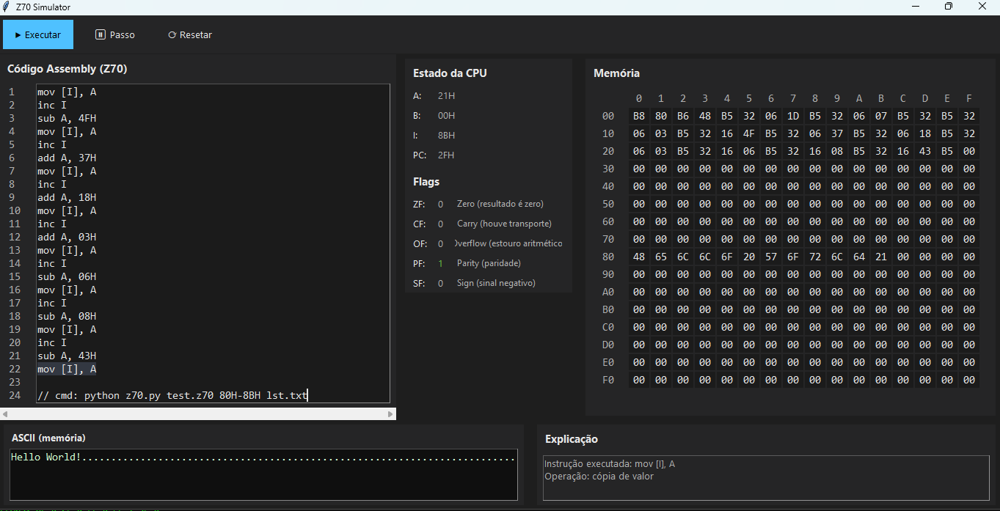

# Z70 Hypothetical Architecture Emulator – GUI Edition

## Introduction

The **Z70 Hypothetical Architecture Emulator** is an educational emulator inspired by the Intel x86 architecture.  
This **GUI Edition** provides a full graphical interface that allows students to **visualize execution in real time**, making low-level concepts tangible and intuitive.

The project is designed for **academic, educational, and self-study purposes**, supporting learners of different levels.

---

## Download and Installation

Clone the repository:

```bash
git clone https://github.com/euRhuanOLiveira/Z70-GUI-Emulator.git
cd Z70
```

(Optional but recommended) Create a virtual environment:

```bash
python -m venv .venv
.venv\Scripts\activate
```

---

## Running the GUI

Start the graphical emulator:

```bash
python app.py
```

---

## Graphical Interface Overview

The GUI is organized into four main vertical sections:

```
[ Editor ] | [ CPU State ] | [ Memory ] | [ ASCII ]
```

### Editor
Write Z70 Assembly code with line highlighting during execution.



### CPU Panel
Displays registers and flags in real time.



### Memory Panel
Shows the 256-byte memory (00H–FFH) in a 16×16 hex grid.



### ASCII Panel
Displays the ASCII interpretation of memory contents, useful for programs like *Hello World*.



---

## Execution Modes

### Run
Executes the entire program at once, equivalent to the CLI behavior.

### Step
Executes one instruction per click, highlighting the current line and explaining the operation.

---

## Didactic Explanation Panel

After each instruction, the emulator explains:
- The instruction executed
- The operation performed
- The effect on flags (Carry, Zero, Overflow, etc.)



---

## Example: Hello World

```asm
mov I, 80H
mov A, 48H
mov [I], A
inc I
add A, 1DH
mov [I], A
inc I
add A, 7H
mov [I], A
inc I
mov [I], A
inc I
add A, 03H
mov [I], A
inc I
sub A, 4FH
mov [I], A
inc I
add A, 37H
mov [I], A
inc I
add A, 18H
mov [I], A
inc I
add A, 03H
mov [I], A
inc I
sub A, 06H
mov [I], A
inc I
sub A, 08H
mov [I], A
inc I
sub A, 43H
mov [I], A
```

Result:
- Memory shows ASCII values
- ASCII panel displays: **Hello**



---

## Project Structure

```
core/
  arch.py
  assembler.py
  CPU.py

gui/
  layout/
  theme/
  i18n/

tests/
  test_z70.py
  test_gui_integration.py

app.py
Z70.py
```

---

## License

MIT License
